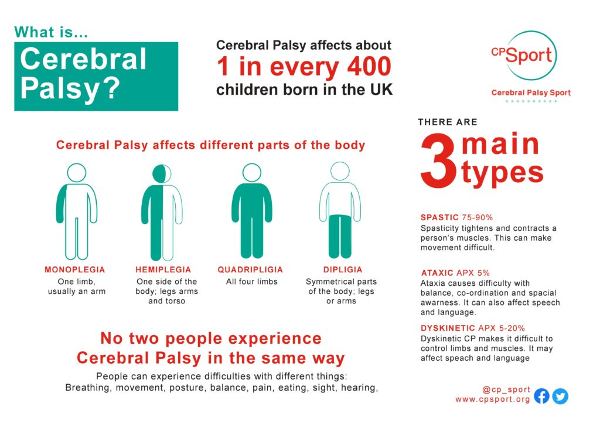
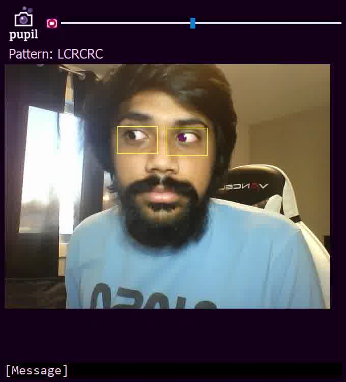
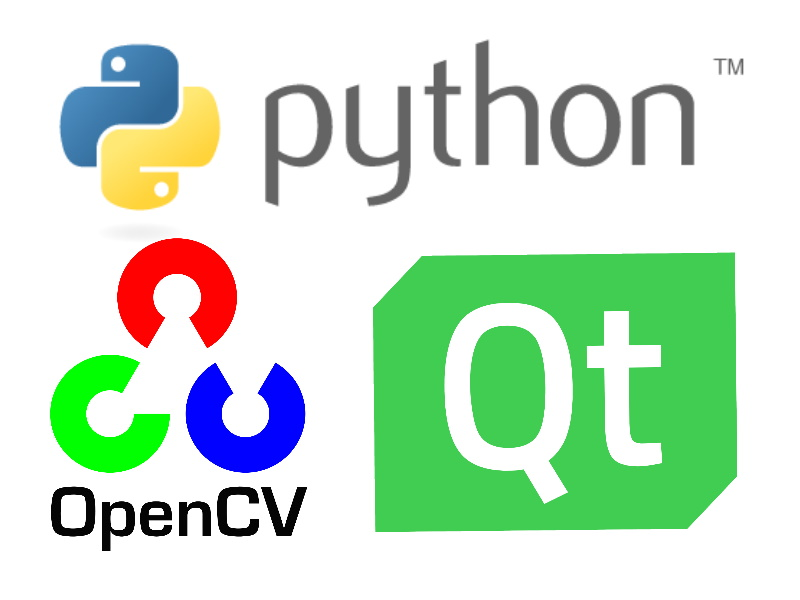
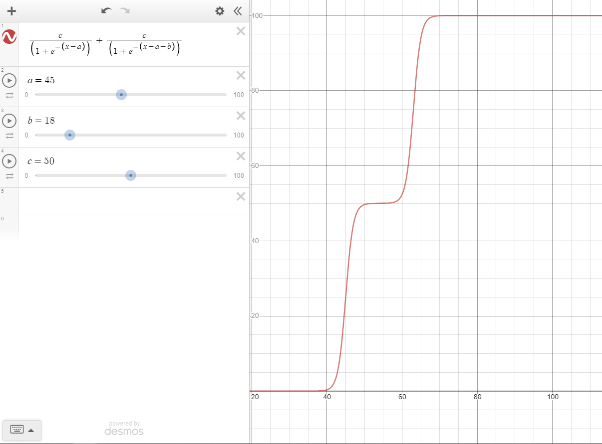
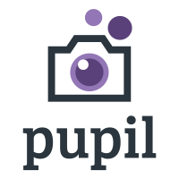

# HackDuke 2020 (Wolfram Award Winner)
## Inspiration
**Cerebral palsy** is a group of movement disorders that is seen in early childhood. It affects movement and muscle tone or posture. This is caused by brain damage that occurs while the brain is still in an immature state, which is often before birth.  
  
[Source](https://www.cpsport.org/resources/cerebral-palsy-key-facts-and-statistics/)
  
Signs and symptoms of cerebral palsy can vary from difficulty to swallow to complete paralysis in the extreme case. Most cerebral palsy patients require assistance to move and walk, and don't have control over some part of their body. This often becomes a barrier to socialization and communication for them.  
  
In aims of allowing effective communication without speech or limb movement for cerebral palsy patients, I decided to work on ***pupil.***
## What it does
***pupil*** is a desktop application that provides an efficient way of communication through eye tracking and movement for people that have their physical movement challenged by cerebral palsy. It does so by recognizing left, right and center movements of the pupil to represent patterns that correspond to pre-defined words or phrases. Users also have the liberty of editing the list of pre-defined words to include their own customized responses.  
  
  
  
## How I built it
***pupil*** is built in **Python** and the user interface is structured using **PyQt5,** with real-time computer vision processes performed in **OpenCV.** Using [Haar Cascade Classification](https://opencv-python-tutroals.readthedocs.io/en/latest/py_tutorials/py_objdetect/py_face_detection/py_face_detection.html) the faces and eyes are located. With the help of [morphological transformations](https://docs.opencv.org/master/d9/d61/tutorial_py_morphological_ops.html) and [blob detection,](https://docs.opencv.org/3.4/d0/d7a/classcv_1_1SimpleBlobDetector.html) ***pupil*** manages to silence the other features of the face, magnify the pupil's area and determine it's exact relative location.  
  

  
In order to calibrate the pupil's location, **multi-state activation functions** were utilized (i.e. left, right and center). Note that situations with different lighting and camera position will require different calibrated constants.  
  
  
  
Click image below for demo video (or click [here](https://youtu.be/_9XTW2mqdjo))  

  
## Challenges I ran into
One of the most challenging aspects of this project was implementing efficient computer vision algorithms. At a certain point the program kept picking up my eyebrow instead of my pupil, and it took a while to get rid of that. Only through a painful process of trial and error was it possible to formulate the right image processing operations to use and the sequence in which to use them. This was my first project involving heavy computer vision algorithms, so more than 90% of this project was learning.  
  
## Accomplishments that I'm proud of
Although HackDuke was a relatively shorter hackathon, I am glad to have managed to produce a working project all by myself! This was my first hackathon project working on computer vision, this experience is only a start to many more experiences!  
  
## What I learned
A key thing I learned is that, more often than not, it is more useful to utilize libraries, functions and trained models that others have made, rather than writing our own. Just because I *can* train my own machine learning model, doesn't mean I *should.* There are lots of people out there who did some of the work for us, so that we can focus on the next step. While I should know how to train a program to find pupils, I should also know how to leverage existing morphological transformations and pre-trained models to do the same.  
  
## What's next for pupil
There is a lot I have yet to work on for ***pupil*** and there are countless other features I would like to add. I plan to make the eye-detection algorithm more efficient, apply natural language processing to multiple output words, and offer cross-platform support.